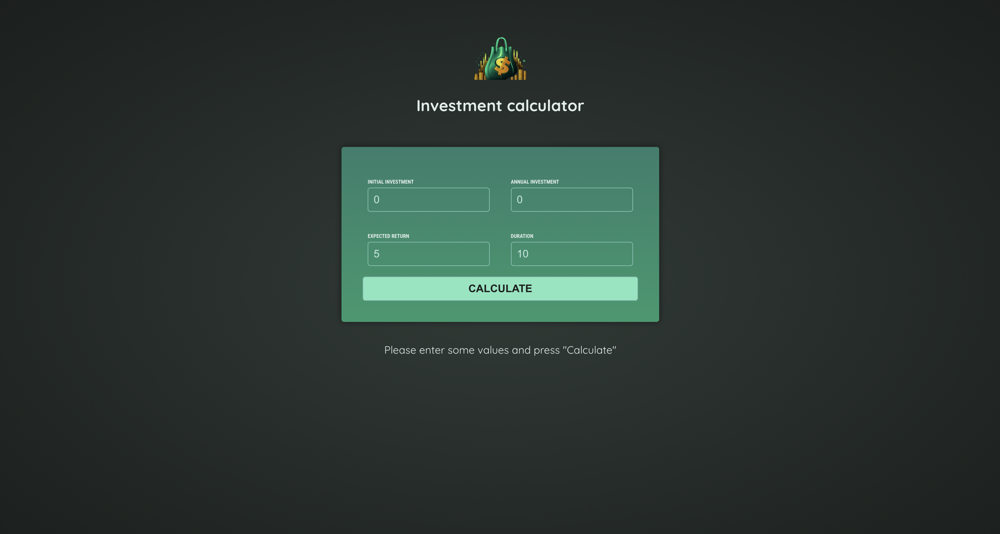

# Investment Calculator

A simple yet powerful investment calculator built with Angular. It helps you estimate your annual returns based on your initial investment, annual contributions, expected return rate, and investment duration. The app features a clean, modern UI for an intuitive and user-friendly experience.

## Technologies used
* HTML5
* CSS3
* Angular
* TypeScript
* Git

## Instructions for Working with the Project

	1. Open your terminal and run the following command to clone the repository:
    
        git clone https://github.com/modeltoIT/investment-calculator.git
    
    2. Move into the project directory:

        cd investment-calculator
    
    3. Ensure that Node.js version v20.x.x is installed. Verify this by running:
    
        node -v
    
        If the version is incorrect, install or update Node.js from Node.js official website.
        
    4. Install the necessary project dependencies by running:
    
        npm install

    5. Start the development server with the command:

        npm start

## View Project

Live Demo: [View the Project](https://modeltoit.github.io/investment-calculator/)

## Preview

